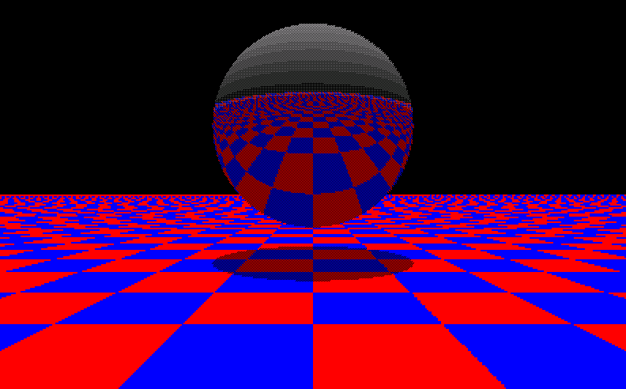

# TiBASIC Ray Tracing

A few programs written in TiBASIC to render and view a raytraced 3D scene. Originally written in 2016.

As seen in [this video](https://www.youtube.com/watch?v=todarS6XTPc).

## RAYTRSPR
 - Renders the sphere scene on your calculator screen

## RAYTRMAX
 - Renders 9 pieces of the sphere scene on your calculator screen and saves them as pictures. This allows for 3 times greater resolution in each direction.

## RECORD
 - Part of RAYTRMAX. Saves each of the pictures.

## PANOVIEW
 - Lets you view the full 3x3 rendered image from RAYTRMAX.
 - Use the arrow buttons to pan.
